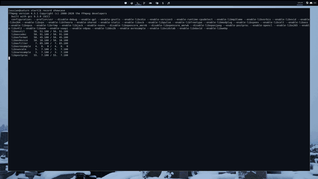

# wal-start

a minimal startpage automatically themed by [(py)wal](https://github.com/dylanaraps/pywal), based on [mpcsh-startpage](https://github.com/startpages/startpages.github.io/tree/master/startpages/mpcsh-startpage).

## setup

change `YOUR_USERNAME_HERE` on the first line of [main.css](main.css).

## example

